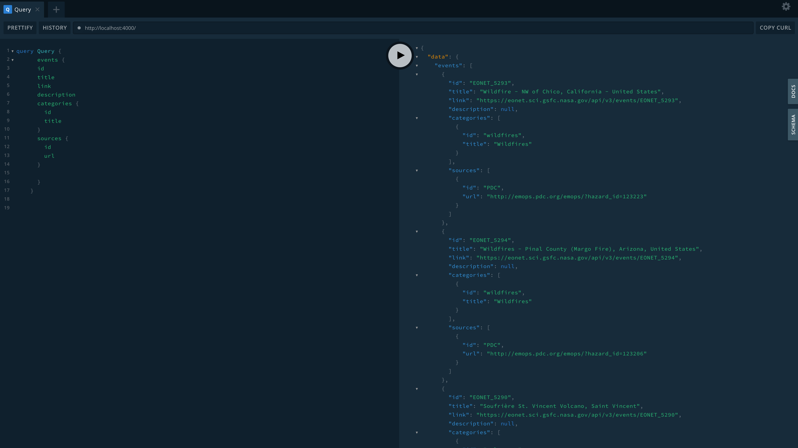

# NASA-EONET-SERVER

##### Setup node modules

```
npm install
```

##### Compiles and runs at http://localhost:4000/

```
npm start
```

##### Query in graphql playground

```
query Query {
      events {
      id
      title
      link
      description
      categories {
        id
        title
      }
      sources {
        id
        url
      }

      }
    }

```



## NASA API's : The Earth Observatory Natural Event Tracker (EONET)

https://api.nasa.gov/

More and more NASA imagery is being made available via web services (WMS, WMTS, etc.) and a significant percentage of it is being produced and published in near real time (NRT=within a few hours after acquisition). This ability means that NASA imagery can be used more routinely to examine current natural events as they happen.

Using client applications, such as NASA EOSDIS’ Worldview, users can browse the entire globe daily and look for natural events as they occur. Storms are regularly spotted in the tropics, dust storms over deserts, forest fires in the summers. These events are occurring constantly and NASA NRT imagery can represent them all using a variety of different data parameters. However, the user’s experience is tailored, and therefore restricted, by the client application. What if there was an API that provided a curated list of natural events and provided a way to link those events to event-related NRT image layers? Enter EONET.

The Earth Observatory Natural Event Tracker (EONET) is a prototype web service with the goal of:

providing a curated source of continuously updated natural event metadata; providing a service that links those natural events to thematically-related web service-enabled image sources (e.g., via WMS, WMTS, etc.). Please see our API documentation to learn more about how to use the EONET web services.

Development of EONET began in 2015 and has been supported by NASA’s Earth Observatory and Earth Science Data and Information System (ESDIS) Project.
